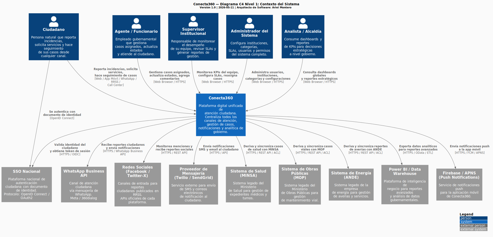
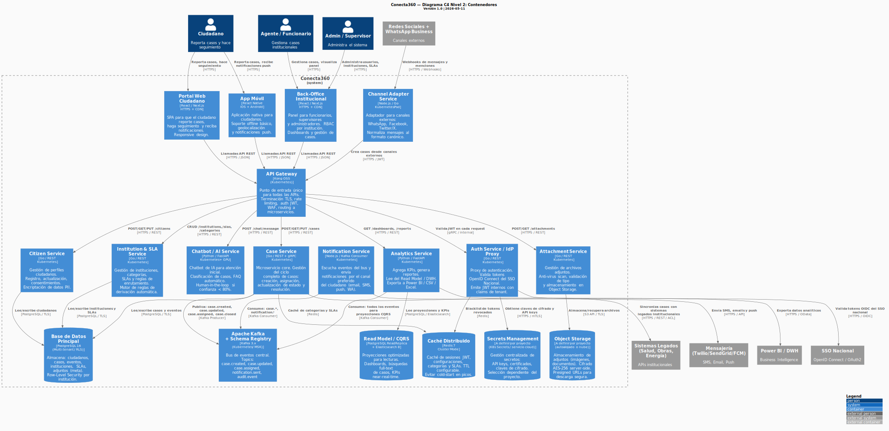
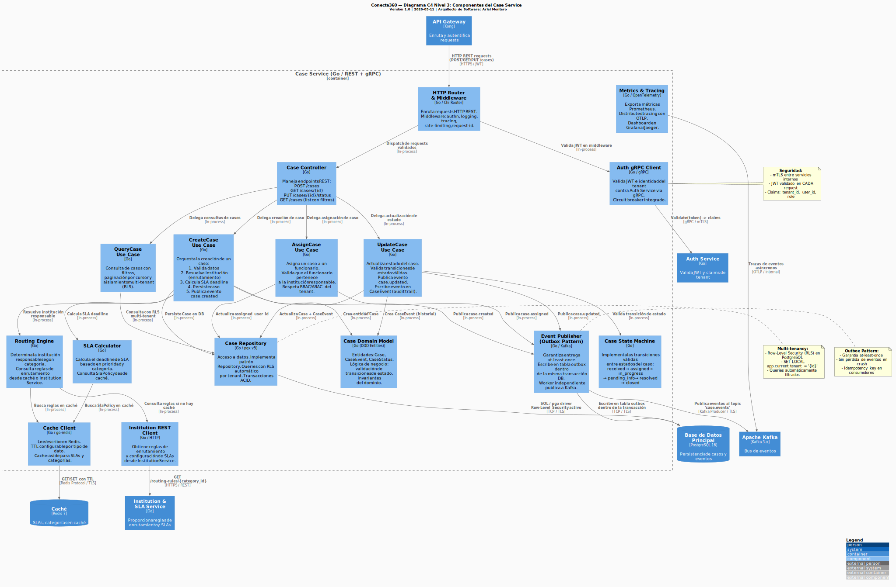
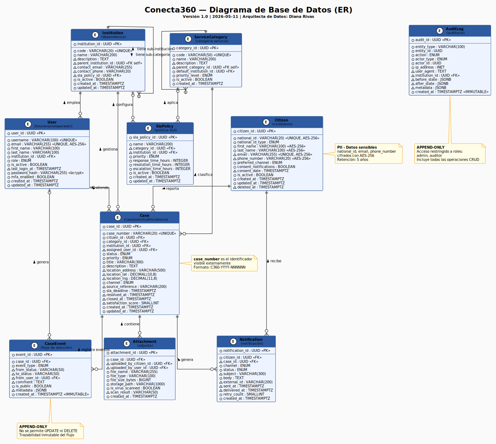

<div align="center">

# 🌐 Conecta360
### Sistema Integral de Atención Ciudadana
**Gobierno de República Dominicana**

---


> **Repositorio de diseño arquitectónico** — Este repositorio es una **Wiki de Arquitectura**.  
> No contiene código de implementación. Contiene análisis, diagramas, decisiones de diseño y especificaciones de API.

</div>

---

## 🗺️ Navegación Rápida

| Sección | Documento | Descripción |
|---------|-----------|-------------|
| 📋 **Requerimientos** | [Listado-Requerimientos.md](./Listado-Requerimientos.md) | RF y RNF analizados por el equipo |
| ⚠️ **Riesgos** | [Matriz-de-Riesgo.md](./Matriz-de-Riesgo.md) | Matriz de riesgos con mitigaciones |
| 📦 **Entregables** | [entregables/Listado-entregables.md](./entregables/Listado-entregables.md) | Índice de todos los artefactos |
| 🏛️ **Arquitectura C4** | [Ver diagramas ↓](#-arquitectura-del-sistema-c4) | Contexto, Contenedores, Componentes |
| 🗄️ **Base de Datos** | [Ver diagrama ↓](#-diagrama-de-base-de-datos) | Modelo ER completo |
| 📖 **Diccionario de Datos** | [diccionario-datos.md](./entregables/diccionario-datos.md) | Entidades, campos, tipos, PII |
| 📐 **Decisiones (ADRs)** | [Ver ADRs ↓](#-decisiones-de-arquitectura-adrs) | 6 ADRs documentados |
| 🔌 **API REST** | [openapi.yaml](./entregables/openapi.yaml) | Spec OpenAPI 3.1 con ejemplos |
| 📨 **Eventos Async** | [asyncapi.yaml](./entregables/asyncapi.yaml) | Spec AsyncAPI 2.6 con payloads |
| 📄 **PRD** | [PRD.md](./PRD.md) | Product Requirements Document original |

---

## 0. Notas del Arquitecto

 Tal como indica el punto 8, el projecto refleja como atacaria este proyecto.  tome un approach AI assisted, utilizado el manejo de agente usando aspectos de BMAD Method v6  y La generacion de Artefactos.  En un entorno real con interaccion humana, las conversaciones par los ADRs y otros documentos estaria reflejada. 

 En mi experiencia con problemas similares, trabaje el proyecto Taina, el cual justamente busca unificar los canales de atencion.  en el caso de Taina mendiante una solucion de AI voz y texto que Identifique la necesidad de servicio y proceda a informar y/o tomar accion en el proceso necesario para el ciudadano.

 El stack que utilizamos en Taina fue Python, Livekit, ChromaDB.  Se realizo una arquitetura dockerizada, implementada en primera fase en VMs con  deploy de load banlancer, y pensando en furuto cluster de kubernetes.

 Yo trabaje el deploy del load balancer y apoye en el ciclo de pruebas UAT.

 Para este ejercio conecta 360, el stack elegido fue Posgres,Kafka, Redis, OpenTelemetry,Kubernetes,OAuth2 / OpenID Connect

 La justicacion esta dada por el rendimiento(performance) que brindan las herramientas. 

 En la practica, sistemas de instancias, es decir micro servicios deployandos en vm estan visualizados para consumir los recursos asignados.  hacer el deploy como malla de servicios en kubernetes es el estandar de escalabidad y gestion de recursos, vista la cantidad de usuarios esperados.

  El esquema propuesto es el de Microservicios 

  Citizen Service
  SLA Service
  Institution Service
  Case Service
  Notification Service
  Reporting Service
  Auth Service 
  Gateway Service 
  Attachment Service

La recomendacion de utilizar golang para la mayoria de los servicios se debe a su rendimiento. 
La justifcacion del stack en la escalabidad.  Un Proof of Concept o MVP para el caso de uso de 360 puede ser implementado sin manejo de eventos u orquestacion, pero al escalar el volumen y necesidad de SLA, las estrategias de optimizacion de flujo recaen en manejo asincronico de eventos y separacion de responsabilidades.


## 1. Contexto del Proyecto

**Conecta360** es una plataforma digital unificada para el **Gobierno de República Dominicana** (10+ millones de habitantes), cuyo propósito es centralizar todos los canales de atención ciudadana:

- 📱 App móvil
- 🌐 Portal web
- 📞 Call center
- 💬 WhatsApp Business
- 🐦 Redes sociales (Facebook, Twitter/X)
- 🏢 Ventanilla física

El sistema permite a los ciudadanos **reportar incidencias, solicitar servicios y hacer seguimiento de casos** con un número único universal, mientras las instituciones gubernamentales gestionan y resuelven los casos desde un panel unificado.

### Problemática que resuelve

| Problema | Solución Conecta360 |
|----------|---------------------|
| 🔴 Fragmentación: cada institución tiene su propio sistema | ✅ Plataforma centralizada multi-institución |
| 🔴 El ciudadano repite sus datos en cada contacto | ✅ Perfil único del ciudadano con historial |
| 🔴 No hay número de caso universal | ✅ Case number único: `C360-YYYY-NNNNNN` |
| 🔴 Informes no comparables entre instituciones | ✅ Dashboard centralizado con KPIs globales |
| 🔴 Sistemas legados sin interoperabilidad | ✅ Anti-Corruption Layer + adaptadores por institución |

---

## 1. Contexto del Proyecto

> Los diagramas siguen el **Modelo C4** (Context → Containers → Components), implementados en **PlantUML** y renderizados como SVG.
>
> Fuentes PlantUML: [`entregables/c4-context.puml`](./entregables/c4-context.puml) · [`entregables/c4-containers.puml`](./entregables/c4-containers.puml) · [`entregables/c4-components.puml`](./entregables/c4-components.puml)

---

### 3.1 Nivel 1 — Contexto del Sistema

> Vista de alto nivel: **actores**, **sistemas externos** y cómo interactúan con Conecta360.



<details>
<summary>📋 Actores y sistemas en este diagrama</summary>

**Personas / Actores:**
- 👤 **Ciudadano** — Reporta incidencias y hace seguimiento vía web, app, WhatsApp o redes sociales
- 👨‍💼 **Agente / Funcionario** — Gestiona casos asignados desde el back-office
- 👔 **Supervisor Institucional** — Monitorea KPIs y SLAs de su institución
- 🔑 **Administrador** — Configura el sistema completo
- 📊 **Analista / Alcaldía** — Consume dashboards estratégicos

**Sistemas Externos:**
- 🔐 **SSO Nacional** — OpenID Connect con documento de identidad ciudadano
- 💬 **WhatsApp Business API** — Canal de mensajería ciudadana
- 🐦 **Facebook / Twitter-X** — Canales de entrada desde redes sociales
- 📧 **Twilio / SendGrid** — Proveedor de SMS y email
- 🏥 **MINSA / MOP / ANDE** — Sistemas legados institucionales
- 📊 **Power BI / DWH** — Plataforma de Business Intelligence

</details>

---

### 3.2 Nivel 2 — Contenedores

> Vista de los **contenedores de software**: microservicios, bases de datos, colas de mensajería y frontends.



<details>
<summary>📋 Contenedores en este diagrama</summary>

**Capa de Presentación:**
| Contenedor | Tecnología | Descripción |
|-----------|-----------|-------------|
| Portal Web Ciudadano | React / Next.js | SPA para reportes y seguimiento de casos |
| Back-Office Institucional | React / Next.js | Panel para funcionarios, supervisores y admins |
| App Móvil | React Native | App iOS/Android con push notifications |

**Capa de Integración:**
| Contenedor | Tecnología | Descripción |
|-----------|-----------|-------------|
| API Gateway | Kong OSS | Punto de entrada único, auth JWT, rate limiting |
| Channel Adapter | Node.js / Go | Normaliza mensajes de WhatsApp, Facebook, Twitter |

**Microservicios Core:**
| Contenedor | Tecnología | Descripción |
|-----------|-----------|-------------|
| Case Service | Go / REST+gRPC | Gestión del ciclo completo de casos |
| Citizen Service | Go / REST | Perfiles ciudadanos y cifrado PII |
| Notification Service | Node.js / Kafka | Envío de notificaciones multicanal |
| Chatbot / AI Service | Python / FastAPI | IA para atención inicial y clasificación |
| Analytics Service | Python / FastAPI | KPIs, dashboards y exportación de datos |
| Institution & SLA Service | Go / REST | Instituciones, categorías y motor de reglas |
| Auth Service | Go / REST | Proxy OIDC y emisor de JWT internos |
| Attachment Service | Go / REST | Gestión de archivos adjuntos |

**Bus de Mensajería:**
| Contenedor | Tecnología | Descripción |
|-----------|-----------|-------------|
| Apache Kafka + Schema Registry | Kafka 3.x | Bus de eventos central con contratos Avro |

**Capa de Datos:**
| Contenedor | Tecnología | Descripción |
|-----------|-----------|-------------|
| Base de Datos Principal | PostgreSQL 16 / RLS | Multi-tenant con Row-Level Security |
| Read Model / CQRS | PostgreSQL Replica + Elasticsearch | Lecturas optimizadas y búsqueda full-text |
| Caché Distribuido | Redis 7 Cluster | Sesiones JWT, SLAs, categorías |
| Object Storage | MinIO / S3 | Archivos adjuntos cifrados AES-256 |
| Secrets Vault | HashiCorp Vault | Gestión centralizada de secretos |

</details>

---

### 3.3 Nivel 3 — Componentes del Case Service

> Vista interna del **Case Service** — microservicio más crítico del sistema. Muestra arquitectura DDD, Outbox Pattern, State Machine y multi-tenancy.



<details>
<summary>📋 Patrones de diseño aplicados en el Case Service</summary>

| Patrón | Componente | Justificación |
|--------|-----------|---------------|
| **Domain-Driven Design** | Case Domain Model | Encapsula lógica de negocio y validaciones |
| **State Machine** | Case State Machine | Garantiza transiciones de estado válidas |
| **Outbox Pattern** | Event Publisher | Garantía at-least-once sin perder eventos en crash |
| **Repository Pattern** | Case Repository | Abstracción del acceso a datos |
| **Circuit Breaker** | REST/gRPC Clients | Resiliencia ante fallos de dependencias |
| **Row-Level Security** | Case Repository | Multi-tenancy a nivel de motor de BD |
| **CQRS** | Query Use Cases | Lecturas van al Read Model, escrituras al Main DB |

</details>

---

## 4. 🗄️ Diagrama de Base de Datos

> Modelo Entidad-Relación de las **10 entidades principales** del sistema.  
> Fuente PlantUML: [`entregables/diagrama-base-datos.puml`](./entregables/diagrama-base-datos.puml)  
> Diccionario completo: [`entregables/diccionario-datos.md`](./entregables/diccionario-datos.md)



<details>
<summary>📋 Resumen de entidades</summary>

| # | Entidad | Descripción | PII | Append-only | Vol. anual estimado |
|---|---------|-------------|:---:|:-----------:|:-------------------:|
| 1 | **Citizen** | Ciudadano registrado | ✅ | — | ~2,000,000 |
| 2 | **User** | Funcionario / Operador | ✅ | — | ~5,000 |
| 3 | **Institution** | Dependencia gubernamental | — | — | ~50 |
| 4 | **ServiceCategory** | Taxonomía de servicios | — | — | ~200 |
| 5 | **Case** | Caso / Solicitud / Incidencia | Indirecto | — | ~10,000,000 |
| 6 | **CaseEvent** | Historial inmutable del caso | — | ✅ | ~50,000,000 |
| 7 | **Notification** | Notificaciones enviadas | Indirecto | — | ~30,000,000 |
| 8 | **Attachment** | Archivos adjuntos a casos | Potencial | — | ~5,000,000 |
| 9 | **SlaPolicy** | Configuración de SLAs | — | — | ~500 |
| 10 | **AuditLog** | Registro de auditoría completo | — | ✅ | ~100,000,000 |

</details>

---

## 5. 📐 Decisiones de Arquitectura (ADRs)

> Cada decisión tecnológica clave está documentada como un **Architectural Decision Record (ADR)** con contexto, alternativas evaluadas y consecuencias.

| ADR | Decisión | Estado | Responsable |
|-----|---------|--------|------------|
| [ADR-001](./entregables/ADR-001-microservicios.md) | Arquitectura de Microservicios + Event-Driven | ✅ Aprobado | Arquitectura |
| [ADR-002](./entregables/ADR-002-base-de-datos.md) | PostgreSQL 16 con Row-Level Security (Multi-tenant) | ✅ Aprobado | Datos |
| [ADR-003](./entregables/ADR-003-mensajeria.md) | Apache Kafka + Schema Registry | ✅ Aprobado | Arquitectura |
| [ADR-004](./entregables/ADR-004-autenticacion.md) | OAuth2/OIDC + RBAC + ABAC | ✅ Aprobado | Seguridad |
| [ADR-005](./entregables/ADR-005-infraestructura.md) | Kubernetes Multi-región + Terraform IaC | ✅ Aprobado | Arquitectura |
| [ADR-006](./entregables/ADR-006-api-gateway.md) | Kong OSS como API Gateway | ✅ Aprobado | Arquitectura |

### Stack Tecnológico Seleccionado

| Capa | Tecnología | ADR |
|------|-----------|-----|
| **Microservicios** | Go (core), Python/FastAPI (AI/Analytics), Node.js (adapters) | ADR-001 |
| **Base de Datos** | PostgreSQL 16 + Row-Level Security | ADR-002 |
| **Mensajería** | Apache Kafka 3.x + Confluent Schema Registry | ADR-003 |
| **Autenticación** | OAuth2 / OpenID Connect + JWT | ADR-004 |
| **Autorización** | RBAC + ABAC | ADR-004 |
| **Orquestación** | Kubernetes 1.29+ (RKE2) | ADR-005 |
| **IaC** | Terraform + Terragrunt | ADR-005 |
| **API Gateway** | Kong OSS 3.x | ADR-006 |
| **Caché** | Redis 7 Cluster | ADR-002 |
| **Object Storage** | MinIO / AWS S3 | ADR-002 |
| **Secrets** | HashiCorp Vault | ADR-004 |
| **Observabilidad** | OpenTelemetry + Prometheus + Grafana + Loki + Jaeger | ADR-005 |
| **CI/CD** | GitLab CI + ArgoCD (GitOps) | ADR-005 |

---

## 6. 🔌 Diseño de APIs (§7.4)

### API REST — OpenAPI 3.1

Documentación completa: [`entregables/openapi.yaml`](./entregables/openapi.yaml)

| Recurso | Endpoints | Descripción |
|---------|-----------|-------------|
| **Cases** | `POST /cases` `GET /cases` `GET /cases/{id}` `PUT /cases/{id}/status` `PUT /cases/{id}/assign` `POST /cases/{id}/satisfaction` | Ciclo de vida completo de casos |
| **Citizens** | `POST /citizens` `GET /citizens/me` `GET /citizens/me/cases` | Registro y perfil del ciudadano |
| **Notifications** | `GET /notifications` | Historial de notificaciones |
| **Analytics** | `GET /analytics/dashboard` `POST /analytics/reports` | KPIs y reportes exportables |
| **Chat** | `POST /chat/message` | Interacción con chatbot IA |

> **Nota:** Todos los endpoints incluyen ejemplos completos de request payload, response y casos de error.

---

### API Asíncrona — AsyncAPI 2.6

Documentación completa: [`entregables/asyncapi.yaml`](./entregables/asyncapi.yaml)

| Topic Kafka | Evento | Publicado por | Consumido por |
|-------------|--------|--------------|--------------|
| `cases.case.created` | Nuevo caso creado | Case Service | Notification, Analytics, Institution |
| `cases.case.assigned` | Caso asignado | Case Service | Notification, Analytics |
| `cases.case.updated` | Caso actualizado | Case Service | Notification, Analytics |
| `cases.case.resolved` | Caso resuelto | Case Service | Notification, Analytics |
| `cases.case.closed` | Caso cerrado | Case Service | Analytics, Audit |
| `cases.case.escalated` | SLA vencido | SLA Scheduler | Notification, Institution |
| `notifications.notification.requested` | Notificación solicitada | Case Service | Notification Service |
| `notifications.notification.sent` | Notificación enviada | Notification Service | Analytics |
| `notifications.notification.failed` | Notificación fallida | Notification Service | Analytics, DLQ |
| `audit.event.recorded` | Evento de auditoría | Todos los servicios | Audit Service |

---

## 7. ⚠️ Análisis de Riesgos

Documento completo: [`Matriz-de-Riesgo.md`](./Matriz-de-Riesgo.md)

### Top 5 Riesgos Críticos

| Score | Riesgo | Mitigación Principal |
|:-----:|--------|---------------------|
| 🔴 20 | Integración con sistemas legacy sin APIs | Inventario + patrón Adapter/ACL en sprint 1 |
| 🔴 20 | Vocabulario distinto por institución (semántica) | Diccionario de Datos Canónico + taller semántico |
| 🔴 16 | Scope creep por demandas institucionales | Change Request Board + MoSCoW |
| 🔴 16 | Rechazo institucional por pérdida de autonomía | Aislamiento lógico + governance board |
| 🔴 15 | Brecha de seguridad de datos PII ciudadanos | SAST/DAST en CI/CD + cifrado AES-256 desde día 1 |

---

## 8. 📋 Requerimientos

Documento completo: [`Listado-Requerimientos.md`](./Listado-Requerimientos.md)

### Requerimientos No Funcionales Clave

| Categoría | Requisito |
|-----------|-----------|
| **Disponibilidad** | 99.9% SLA — failover automático multi-región |
| **Escalabilidad** | Hasta 500,000 solicitudes diarias |
| **Seguridad** | AES-256 + OAuth2/OIDC + segregación por entidad |
| **Rendimiento** | < 1.5 s tiempo promedio de respuesta |
| **Multitenencia** | Multi-institución con aislamiento lógico (RLS) |
| **Integrabilidad** | REST + Kafka/Async para sistemas legados |

---

## 9. 📦 Índice Completo de Entregables

Índice maestro: [`entregables/Listado-entregables.md`](./entregables/Listado-entregables.md)

```
conecta360/
├── README.md                               ← Este archivo (Wiki principal)
├── PRD.md                                  ← Product Requirements Document
├── Listado-Requerimientos.md               ← RF y RNF analizados
├── Matriz-de-Riesgo.md                     ← Análisis de riesgos
└── entregables/
    ├── Listado-entregables.md              ← Índice maestro de entregables
    ├── diccionario-datos.md                ← Diccionario de Datos Canónico
    ├── diagrama-base-datos.puml            ← Fuente PlantUML — ER
    ├── c4-context.puml                     ← Fuente PlantUML — C4 Contexto
    ├── c4-containers.puml                  ← Fuente PlantUML — C4 Contenedores
    ├── c4-components.puml                  ← Fuente PlantUML — C4 Componentes
    ├── ADR-001-microservicios.md           ← ADR: Microservicios + Event-Driven
    ├── ADR-002-base-de-datos.md            ← ADR: PostgreSQL + RLS
    ├── ADR-003-mensajeria.md               ← ADR: Apache Kafka
    ├── ADR-004-autenticacion.md            ← ADR: OAuth2/OIDC + RBAC/ABAC
    ├── ADR-005-infraestructura.md          ← ADR: Kubernetes Multi-región
    ├── ADR-006-api-gateway.md              ← ADR: Kong OSS
    ├── openapi.yaml                        ← API REST (OpenAPI 3.1)
    ├── asyncapi.yaml                       ← Eventos Kafka (AsyncAPI 2.6)
    └── img/
        ├── c4-context.svg                  ← Diagrama renderizado
        ├── c4-containers.svg               ← Diagrama renderizado
        ├── c4-components.svg               ← Diagrama renderizado
        └── diagrama-base-datos.svg         ← Diagrama renderizado
```

---

## 10. 📚 Referencias

| Recurso | Descripción |
|---------|-------------|
| [arc42](https://arc42.org) | Estructura de arquitectura de software |
| [C4 Model](https://c4model.com) | Modelado de arquitectura a niveles de abstracción |
| [PlantUML C4](https://github.com/plantuml-stdlib/C4-PlantUML) | Librería C4 para PlantUML |
| [AsyncAPI](https://asyncapi.com) | Especificación para APIs asíncronas |
| [microservices.io](https://microservices.io) | Mejores prácticas en arquitectura de microservicios |
| [ADR GitHub](https://adr.github.io) | Convención de Architectural Decision Records |
| [OpenAPI 3.1](https://spec.openapis.org/oas/v3.1.0) | Especificación OpenAPI |

---

<div align="center">

**Conecta360** · Gobierno de República Dominicana · Versión 1.0 · 2026  
*Repositorio de Diseño Arquitectónico — No contiene código de implementación*

</div>
